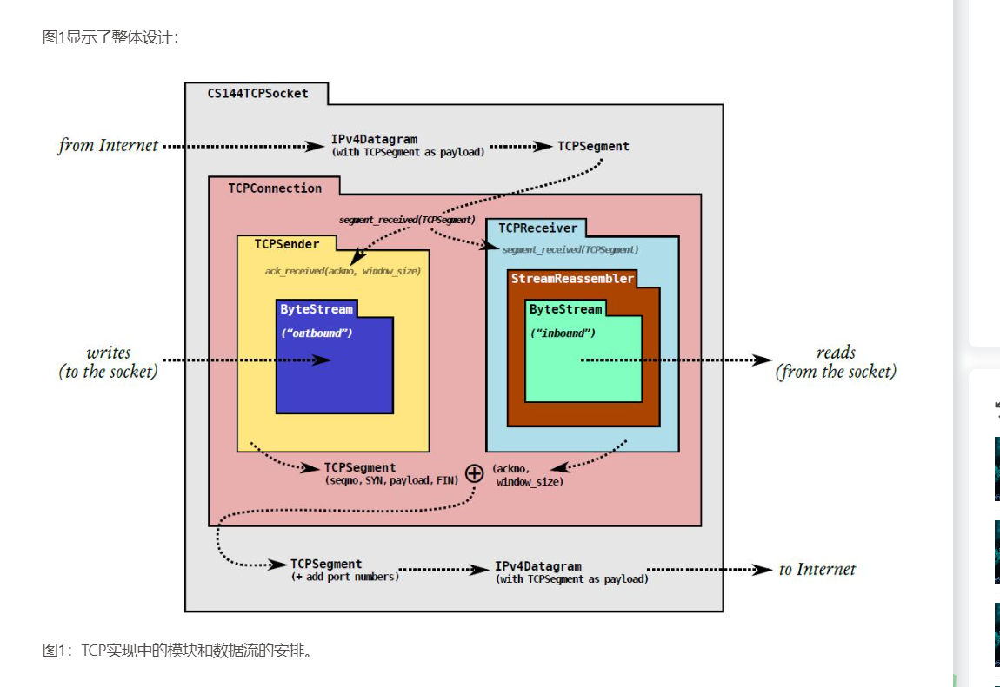
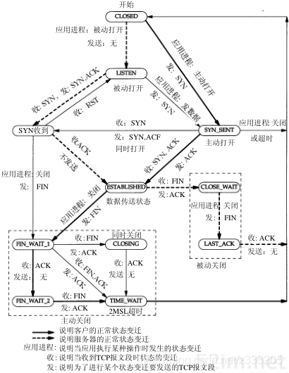

# CS144-2022

#### Lab0 - lab3

和2023版本大差不差  快速完成 不进行笔记了

lab0-lab3的笔记在这里面 其中lab3实现差异较大

2023: [https://github.com/TTaket/CS144-2023Spring](https://github.com/TTaket/CS144-2023Spring)

#### Lab4

lab4的笔记在 这个仓库writeups下面的lab4

---

整体设计：

    

状态设计：

     

---

原网站：[https://cs144.github.io/](https://cs144.github.io/)

Keith Winstein 大佬的仓库（startcode)：[https://github.com/h3n4l/CS144-sponge-2022/tree/master)](https://github.com/h3n4l/CS144-sponge-2022/tree/master)

Doraemonzzz 大佬的网站（中文翻译）：[http://doraemonzzz.com/](http://doraemonzzz.com/)
