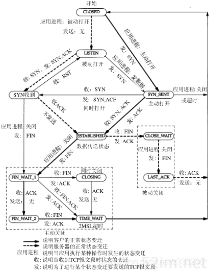

Lab 4 Writeup
=============

#### Lab4 - part1 整理

回顾我们有的东西：

Lab0 我们实现了应用层  和一个可靠的字节流

Lab1 我们对这个字节流进行了封装成为重组器 使得他能接受乱序的包并且自动排序

Lab2 我们着手完成接收端 接收端的本质是一个重组器 segment_received函数用于接受一个TCPReceiver包

Lab3 我们着手完成发送端 它的初始化是一个字节流 提供了 fillwindow 会自动对字节流里面的内容进行封装 以生成多个零散的包放置到_segement_out 队列里面

到了现在为止 我们要进行发送器和接收器的合并 我们整理下这两个子模块的功能

发送端：

    void ack_received 用于接受一个ack包 以更新sender的内部属性

    void send_empty_segment();发送一个空的包

    void fill_window(); 填充_segment_out

    void tick(constsize_tms_since_last_tick); 定时器 负责管理重传

    size_t bytes_in_flight() const; 返回队列里等待确认的包的数量

    unsigned int consecutive_retransmissions() const; 返回重传次数

    uint64_t next_seqno_absolute() const { return_next_seqno; }返回下一个绝对序列号

    WrappingInt32next_seqno() const { returnwrap(_next_seqno,_isn); } 返回下一个序列号

接收端：

    std::optional`<WrappingInt32>` ackno() const; 返回应该接受的ack号（可能有）

    size_t window_size() const;返回窗口大小

    size_t unassembled_bytes() const;返回重组器里没有重组的数量

    void segment_received(constTCPSegment&seg); 接受一个字段

#### Lab4 - part2 行为规划

整体设计：

    

状态设计：

    

接受包行为 ：

1. 接受到一个包 TCPSegment
2. 如果这个包有ack和窗口大小 - > 用ack_received发送给TcpSender
3. 把这个包剩余信息通过 segment_received 交给TCPReceiver

发送包行为 ：

1. 从fillwindow 装填 _segement_out队列
2. 从队里里面取出一个包
3. 用 `TCPReceiver` 设置ackno 和 windowsize字段
4. 发送出去

   ---

Lab4 由于时间问题 暂时参照的大佬的Lab4实现 也只能实现部分 

[Stanford-CS144-Sponge 笔记 - Lab 4: The TCP Connection | 吃着土豆坐地铁的博客 (epis2048.net)](https://www.epis2048.net/2022/cs144-lab4/)
